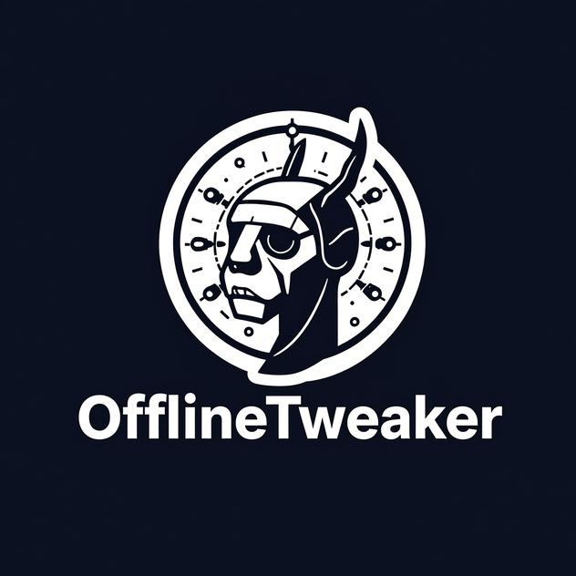

<p align="center">
  
</p>

You're not paying for this. I'm not paying for this. Nobody's paying for
this. That's the whole point.

OfflineTweaker is an offline AI coding agent that runs on your laptop,
your phone, or a random VM you found in a datacenter. No API keys, no
monthly fees, nobody's credit card on file. Download it, run it, fix
your broken code anywhere with no signal.

## What This Actually Is

- **Desktop**: Dockerized environment with Ollama, Continue.dev, Aider, and Jupyter. The good stuff.
- **Android**: Runs directly in Termux with native llama.cpp. No server, no Docker, no bullshit. Your phone is a coding assistant now.
- **Cloud**: SSH tunnel into a remote box or use third-party APIs (OpenRouter, Together, etc). You choose when to go online. I'll judge you for it, but I get it, sometimes you need a bigger hammer.

If you're still paying for AI, you're doing it wrong.

## Quick Start

### Desktop

```bash
git clone https://github.com/SecTrollz/OfflineTweaker.git
cd OfflineTweaker
./setup.sh
docker compose up -d
docker exec -it ollama ollama pull qwen2.5-coder:7b   # start small, upgrade later
```

Open `http://localhost:8080` for code-server. `setup.sh` prints the
password once, then reprints it again at the end of the run so you're
not stuck scrolling back for it, save it to a password manager or
wherever you keep things, it's also always sitting in plain text in
`.env` if you lose it. `http://localhost:3000` gets you the Open WebUI
chat. Full walkthrough, including the Continue extension: see
[Desktop (Docker)](#desktop-docker) below.

### Android (Termux)

```bash
git clone https://github.com/SecTrollz/OfflineTweaker.git
cd OfflineTweaker/android
chmod +x termux-setup.sh
./termux-setup.sh
termux-wake-lock
~/run-model.sh
```

Open `http://127.0.0.1:8080` in Chrome, or in a second Termux session run
`~/aider-local.sh` or `./agent-loop.sh`. RAM gets auto-detected, override
with `--ram 8gb` if it guesses wrong. More detail: see
[On-Device (Android / Termux)](#on-device-android--termux) below.

## Features

- **Autonomous build loop.** Give it a task, it writes code, runs your tests, reads the failures, fixes itself, repeats until the tests pass or it gives up. Like a junior dev who doesn't complain. See [Autonomous Build Loop](#autonomous-build-loop).
- **Aider, Continue.dev, Jupyter.** Pick your poison. I don't care what you use, just ship code.
- **Cross platform.** Same agent loop runs on desktop (Ollama) and Android (llama.cpp). Rewriting things twice is for people with chargeback money.
- **RAM aware on Android.** Auto detects device RAM, picks a matching model and context budget. No flags needed. You're welcome.
- **Resumable, verified model downloads.** Interrupted downloads resume, get checksum verified, then get locked read only. I've been burned by corrupted downloads mid flight. Never again.
- **Optional log encryption.** Encrypt logs with age if you're paranoid. I'm not, but you might be.
- **Cloud bridge.** Tunnel into a rented VM or use a hosted API when local compute isn't enough. It warns you every time. No sneaky cloud charges. See [Cloud](#cloud).

## Desktop (Docker)

Models: Qwen2.5-Coder on desktop, DeepSeek-R1 distills on Android.

Agent modes:
- **Autonomous build loop** (`agent/build-loop.sh`): the main event. See [Autonomous Build Loop](#autonomous-build-loop) below.
- Continue.dev in VS Code: /edit, /run, refactoring.
- Aider: `aider --model ollama/qwen2.5-coder:14b` in the terminal.
- Jupyter notebooks for when you want to be fancy.

Tips:
- `setup.sh` generates a random password into `.env`, never committed. It prints once when generated and again at the end of the run, save it somewhere real, don't just trust your scrollback. Edit `.env` yourself anytime to change it, then `docker compose up -d`.
- Ports bind to 127.0.0.1 by default, safe on shared boxes too. See [Cloud](#cloud) to expose them.
- For GPU, add the NVIDIA section in compose.
- Image versions are pinned, not `:latest`, so upstream breaks won't surprise you. Override with `OLLAMA_DOCKER_TAG=latest` in `.env` if you like living dangerously (that's exactly the risk pinning exists to avoid).
- Workspace: `./workspace`, persisted forever.
- Fully offline after the model pull, unless you go [Cloud](#cloud).
- Export to GitHub anytime, even offline code needs to be shared with the world eventually.

Generated files live in `./workspace` and `./continue-config`, they need
to be there or nothing works. Details in
[Advanced](#desktop-generated-files-and-mount-paths) if you're curious.

## On-Device (Android / Termux)

Fully offline, no server, no Docker, just Termux and llama.cpp. Works on
any Termux capable Android phone. RAM auto-detected via `/proc/meminfo`
and bucketed into a tier. No need to know your phone's name.

```bash
git clone https://GitHub.com/SecTrollz/OfflineTweaker.git
cd OfflineTweaker/android
chmod +x termux-setup.sh
./termux-setup.sh
termux-wake-lock
~/run-model.sh
```

(Setting up the Docker desktop stack instead? See [Desktop (Docker)](#desktop-docker) above for `./setup.sh`.)

Then either:
- open `http://127.0.0.1:8080` in Chrome for a chat UI, or
- in a second Termux session, run `~/aider-local.sh` inside a project directory, or `./agent-loop.sh` for the [autonomous build loop](#autonomous-build-loop). Both use the same local model, no cloud keys needed.

`termux-setup.sh` ends with a summary that actually matters, not
boilerplate. It's your confirmation the auto-detect picked what you
expected:

```
Done. Recommended next steps:
  1. termux-wake-lock            # stop Android from suspending inference
  2. ~/run-model.sh              # starts the model on http://127.0.0.1:8080
  3a. Open http://127.0.0.1:8080 in Chrome for the built-in chat UI, or
  3b. In a second Termux session: cd your-project && ~/aider-local.sh
      for a manual agentic coding CLI, or android/agent-loop.sh for the
      autonomous write-test-fix loop (reads this saved profile
      automatically, no flags needed).

Model: DeepSeek-R1-Distill-Qwen-7B (Q4_K_M) (alias: deepseek-r1-qwen-7b, role: reasoning)
Context: 4096 tokens | Threads: 8
Profile saved to: /data/data/com.termux/files/home/.offlinetweaker/profile.env
```

Check the `Model`/`Context`/`Threads` line to confirm it picked the tier
you expected (force a different one with `--ram`, see the table below).
`Profile saved to` is that same choice written to disk, `agent-loop.sh`
reads it automatically so you never have to re-type which model you're on.

Model picked per RAM tier:

| Tier | Typical RAM | Model | Size |
|------|-------------|-------|------|
| 3gb  | ~3GB  | DeepSeek-R1-Distill-Qwen-1.5B (Q4_K_M) | ~1.1GB |
| 4gb  | ~4GB (e.g. Moto G 5G) | DeepSeek-R1-Distill-Qwen-1.5B (Q4_K_M) | ~1.1GB |
| 6gb  | ~6GB  | DeepSeek-R1-Distill-Qwen-1.5B (Q4_K_M) | ~1.1GB |
| 8gb  | ~8GB (e.g. Pixel 9a) | DeepSeek-R1-Distill-Qwen-7B (Q4_K_M) | ~4.4GB |
| 12gb | ~12GB | DeepSeek-R1-Distill-Llama-8B (Q4_K_M) | ~4.9GB |
| 16gb | 16GB+ | DeepSeek-R1-Distill-Qwen-14B (Q4_K_M) | ~8.4GB |

Same model at 3/4/6GB tiers because DeepSeek only ships a 1.5B or a 7B+,
nothing in between. The extra headroom on a 6GB phone just buys more
context. Override with `--ram 8gb` if it guesses wrong, or use the
legacy aliases `./setup.sh pixel9a` / `motog5g`.

**Coding lane, `--role coding`, still experimental.** The default models
are reasoning distills, good at diagnosis but they burn tokens on
`<think>` traces. `--role coding` swaps in a code tuned model instead,
Qwen2.5-Coder-1.5B-Instruct, Apache 2.0, on the lower tiers. No reasoning
overhead.

```bash
./termux-setup.sh --ram 6gb --role coding
```

Only works on 3/4/6GB tiers right now. Higher tiers error out cleanly
instead of silently falling back, since there's no vetted coding model
at those sizes yet. This is newer than the reasoning lane, report bugs
if you hit any.

Notes:
- `termux-setup-storage` runs automatically, the model survives Termux updates.
- `termux-wake-lock` keeps Android from sleeping mid inference, but it doesn't stop Android from killing Termux outright if RAM runs low, that's a different mechanism. `run-model.sh` checks free memory against the model size before launching and warns if it looks tight, see [Troubleshooting](docs/troubleshooting.md) if Termux keeps closing on you.
- Expect `<think>` traces on the reasoning lane. Trim them client side, or just use `--role coding` above to skip them.
- Profile saved to `~/.offlinetweaker/profile.env`, agent scripts read it automatically.
- Interrupted downloads resume. Partial files get checksum verified before use, same as a fresh download.
- Model files are locked read only (`chmod 444`, best effort `chattr +i`), nothing modifies them. To force a re-download, remove it yourself: `chattr -i ~/models/*.gguf 2>/dev/null; rm -f ~/models/*.gguf*`.

## Autonomous Build Loop

A thin wrapper around [Aider](https://aider.chat) that makes it set and
forget. Give it a task, it edits the code, runs your test command, feeds
the failures back, repeats until the tests pass or it hits a limit.

```bash
# Desktop
./agent/build-loop.sh --dir ./workspace/my-app \
  --task "Add a /health endpoint" \
  --model qwen2.5-coder:14b --api-base http://localhost:11434/v1 \
  --test-cmd "pytest -q"

# Android, profile is read automatically
cd android
./agent-loop.sh --dir ~/projects/my-app \
  --task "Fix failing tests" --test-cmd "python -m pytest -q"
```

How it works:
- A short built-in system preamble keeps responses terse. Override it with `OFFLINETWEAKER_SYSTEM_PROMPT`.
- Aider edits the code in `--dir`.
- `--test-cmd` runs.
- On failure, the last `--max-feedback-chars` of output gets fed back.
- Repeats up to `--max-iters` (default 5).
- Every run gets logged under `<project-dir>/.offlinetweaker/agent-logs/<timestamp>/`.

Skip `--test-cmd` for a one shot edit with no verification loop.

**Encrypting logs, optional.** Use
`--encrypt-logs <age-recipient-or-keyfile>`, one time `age-keygen` setup
and it's automatic after that. Full details in
[Advanced](#encrypting-agent-logs).

**Context tuning.** Small models need trimming. Two flags handle it:
- `--max-feedback-chars N`, how much test output gets fed back on retry.
- `--map-tokens N`, Aider's repo map budget.

Android sets both automatically per tier:

| Tier | Context | `--map-tokens` | `--max-feedback-chars` |
|------|---------|-----------------|--------------------------|
| 3gb  | 1536    | 0 (disabled)    | 900  |
| 4gb  | 2048    | 0 (disabled)    | 1200 |
| 6gb  | 3072    | 256             | 2000 |
| 8gb  | 4096    | 512             | 3000 |
| 12gb | 6144    | 768             | 3500 |
| 16gb | 8192    | 1024            | 4000 |

Desktop just uses Aider's own defaults, full context doesn't need the trim.

## Cloud

Need more power? Point the loop at a bigger model somewhere else, either
your own rented VM or a third party API. Both go through
`cloud/agent-loop.sh`:

```bash
# Your own VM, SSH tunnel by default
./cloud/agent-loop.sh --host user@1.2.3.4 --model qwen2.5-coder:14b \
  --dir ./myproj --task "Add validation" --test-cmd "pytest -q"

# VM already on a private network (Tailscale), skip the tunnel
./cloud/agent-loop.sh --host 100.x.y.z --no-tunnel \
  --model qwen2.5-coder:14b --dir ./myproj --task "..."

# Third party API (OpenRouter, Together, etc), leaves the machine,
# not offline anymore, the script warns every time.
# Export the key instead of passing it on the command line,
# it shows up in `ps` and shell history otherwise:
export OPENAI_API_KEY="$OPENROUTER_API_KEY"
./cloud/agent-loop.sh --provider openrouter \
  --model deepseek/deepseek-r1 --dir ./myproj --task "..."
```

The "your own VM" path uses the same `setup.sh` as desktop. Run it on the
rented box, then connect with the command above instead of opening ports
to the public internet. Every `agent/build-loop.sh` flag passes straight
through.

## Advanced

Stuff you probably don't need day to day, but it's here if you do.

### Desktop generated files and mount paths

`docker-compose.yml`, `.env`, `workspace/requirements.txt`,
`workspace/setup_venv.py`, `continue-config/config.json`. All generated
by `setup.sh` and gitignored. Edit `setup.sh` if you want the defaults to
change, or edit the generated files directly for a one off tweak
(re-running `setup.sh` won't overwrite them). The last three have to live
inside the folders docker-compose mounts into code-server
(`./workspace` maps to `/home/coder/workspace`, `./continue-config` maps
to `/home/coder/.continue`). That placement isn't cosmetic, code-server
and Continue just won't see them otherwise.

### Encrypting agent logs

By default, [Autonomous Build Loop](#autonomous-build-loop) logs are
plaintext. To encrypt with [age](https://age-encryption.org):

```bash
age-keygen -o ~/.offlinetweaker/logs-key.txt
./agent/build-loop.sh --dir ./myproj --task "..." --model ... --api-base ... \
  --encrypt-logs age1yourpublickeyhere...
# or pass the key file instead of the raw key text:
--encrypt-logs ~/.offlinetweaker/logs-key.txt
```

Every log the run produces, including Aider's own chat history, gets
encrypted to that key and the plaintext gets deleted. Decrypt with:

```bash
age -d -i ~/.offlinetweaker/logs-key.txt iteration-1.log.age
```

That key file is the only thing that can decrypt these, guard it like a
password (`age-keygen` already sets it `chmod 600`). This uses asymmetric
encryption on purpose, not a passphrase. A passphrase means re-typing it
on every file write, which doesn't work for an unattended loop, and
age's own passphrase mode refuses to run non-interactively anyway.

## FAQ

**What is OfflineTweaker?**
An open source offline AI coding agent. It runs local language models on
your own hardware, laptop, phone, or a rented box, and drives them
through Aider to write, test, and fix code.

**Does it work without an internet connection?**
Yes, once it's set up. You need internet the first time to clone the
repo, build llama.cpp, and pull a model. After that, `run-model.sh` and
the agent loops don't touch the network unless you go [Cloud](#cloud)
on purpose.

**Can it run on Android?**
Yes. That's the whole [On-Device (Android / Termux)](#on-device-android--termux)
section. No root needed, no Play Store Termux either, use the F-Droid build.

**Does it support Termux?**
Yes, Termux is the only way the Android path works. Native llama.cpp,
built on device, no server, no Docker.

**Which local models can it run?**
DeepSeek-R1 distills and Qwen2.5-Coder on Android, picked automatically
by RAM tier (see the [model table](#on-device-android--termux)).
Qwen2.5-Coder on desktop through Ollama. Any GGUF llama.cpp supports or
any model Ollama can pull will technically run, these are just the ones
auto-configured out of the box.

**Can it use llama.cpp?**
Yes. That's exactly what `termux-setup.sh` builds natively on your
phone, no prebuilt binary, no root.

**Can it use Ollama?**
Yes, that's the desktop path. `setup.sh` stands up Ollama in Docker
alongside Aider, Continue.dev, and Jupyter.

**Can it work with Aider?**
Yes, Aider isn't optional, it's what actually drives the coding. The
[Autonomous Build Loop](#autonomous-build-loop) is a wrapper around it.

**Can it run on limited RAM?**
Yes, that's the point of the Android RAM tiers. The smallest tier
targets ~3GB devices with a 1.5B model.

**Does it require an API key?**
No, not for local use on desktop or Android. You only need one if you
opt into a third party API under [Cloud](#cloud), and it's never
required.

**Is OfflineTweaker open source?**
Yes, Apache 2.0. See [License](#license) below.

**Can I use it for software development completely locally, no cloud at all?**
Yes. That's the default. Cloud is opt-in, not required for any of this
to work.

## More Docs

- [Troubleshooting](docs/troubleshooting.md), real errors this thing has actually hit on real devices and how they got fixed.
- [Architecture](docs/architecture.md), how the pieces actually fit together.

## License

Apache 2.0. Use it, modify it, sell it, I don't care. Just don't ask me
for support. See [LICENSE](LICENSE).

## Contributing

See [CONTRIBUTING.md](CONTRIBUTING.md). If you break it, you bought it.
If you fix it, you're a hero. I don't care either way.

---

Built with real hardware, too much caffeine, and no subscription in sight.
